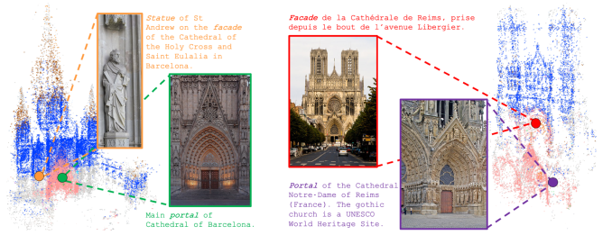

# Towers of Babel: Combining Images, Language, and 3D Geometry for Learning Multimodal Vision
Download links and PyTorch implementation of "Towers of Babel: Combining Images, Language, and 3D Geometry for Learning Multimodal Vision", ICCV 2021.
> Towers of Babel: Combining Images, Language, and 3D Geometry for Learning Multimodal Vision
>
> [Xiaoshi Wu](https://github.com/tgxs002), [Hadar Averbuch-Elor](cs.cornell.edu/~hadarelor), [Jin Sun](cs.cornell.edu/~jinsun), [Noah Snavely](https://www.cs.cornell.edu/~snavely/) 
> ICCV 2021
>
#### [Project Page](https://www.cs.cornell.edu/projects/babel/) | [Paper](https://www.cs.cornell.edu/projects/babel/) 

| <br> |
|:---|

### The WikiScenes Dataset
1. **Image and Textual Descriptions:** WikiScenes contains 63K images with captions of 99 cathedrals. We provide two versions for download:
   - Low-res version used in our experiments (maximum width set to 200[px], aspect ratio fixed): [ (1.9GB .zip file)](https://www.cs.cornell.edu/projects/babel/WikiScenes.zip)
   - Higher-res version (maximum longer dimension set to 1200[px], aspect ratio fixed): [ (19.4GB .zip file)](https://www.cs.cornell.edu/projects/babel/WikiScenes1200px.zip)

   *Data Structure*
   
    WikiScenes is organized recursively, following the tree structure in Wikimedia. 
    Each semantic category (e.g. cathedral) contains the following recursive structure:
    ```
    ----0 (e.g., "milano cathedral duomo milan milano italy italia")
    --------0 (e.g., "Exterior of the Duomo (Milan)")
    ----------------0 (e.g., "Duomo (Milan) in art - exterior")
    ----------------1
    ----------------...
    ----------------K0-0
    ----------------category.json
    ----------------pictures (contains all pictures in current hierarchy level)
    --------1
    --------...
    --------K0
    --------category.json
    --------pictures (contains all pictures in current hierarchy level)
    ----1
    ----2
    ----...
    ----N
    ----category.json
    ```
    category.json is a dictionary of the following format: 
    ```
    {
        "max_index": SUB-DIR-NUMBER
        "pairs" :    {
                        CATEGORY-NAME: SUB-DIR-NAME
                    }
        "pictures" : {
                        PICTURE-NAME: {
                                            "caption": CAPTION-DATA,
                                            "url": URL-DATA,
                                            "properties": PROPERTIES
                                    }
                    }
    }
    ```
    where:
    1. SUB-DIR-NUMBER is the total number of subcategories
    2. CATEGORY-NAME is the name of the category (e.g., "milano cathedral duomo milan milano italy italia")
    3. SUB-DIR-NAME is the name of the sub-folder (e.g., "0") 
    4. PICTURE-NAME is the name of the jpg file located within the pictures folder
    5. CAPTION-DATA contains the caption and URL contains the url from which the image was scraped.
    6. PROPERTIES is a list of properties pre-computed for the image-caption pair (e.g. estimated language of caption).
2. **Keypoint correspondences:** We also provide keypoint correspondences between pixels of images from the same landmark: [ (982MB .zip file)](https://www.cs.cornell.edu/projects/babel/correspondence.json.zip)

   *Data Structure*
   ```
    {
        "image_id" : {
                        "kp_id": (x, y),
                    }
    }
    ```
    where:
    1. image_id is the id of each image.
    2. kp_id is the id of keypoints, which is unique across the whole dataset.
    3. (x, y) the location of the keypoint in this image.
3. **COLMAP reconstructions:** We provide the full 3D models used for computing keypoint correspondences: [ (1GB .zip file)](https://www.cs.cornell.edu/projects/babel/WikiScenes3D.zip)
   
   To view these models, download and install [COLMAP](https://colmap.github.io/). The reconstructions are organized by landmarks. Each landmark folder contains all the reconstructions associated with that landmark. Each reconstruction contains 3 files:
   1. points3d.txt that contains one line of data for each 3D point associated with the reconstruction. The format for each point is: POINT3D_ID, X, Y, Z, R, G, B, ERROR, TRACK[] as (IMAGE_ID, POINT2D_IDX).
   2. images.txt that contains two lines of data for each image associated with the reconstruction. The format of the first line is: IMAGE_ID, QW, QX, QY, QZ, TX, TY, TZ, CAMERA_ID, NAME. The format of the second line is: POINTS2D[] as (X, Y, POINT3D_ID)
   3. cameras.txt that contains one line of data for each camera associated with the reconstruction according to the following format: CAMERA_ID, MODEL, WIDTH, HEIGHT, PARAMS[]
   
   Please refer to COLMAP's [tutorial](https://colmap.github.io/tutorial.html) for further instructions on how to view these reconstructions.
    
4. **Companion datasets for additional landmark categories:** We provide download links for additional category types: 

    *Synagogues*
    
     [Images and captions (PENDING .zip file)](https://www.cs.cornell.edu/projects/babel), [correspondences (PENDING .zip file)](https://www.cs.cornell.edu/projects/babel), [reconstructions (PENDING .zip file)](https://www.cs.cornell.edu/projects/babel)

    *Mosques*
    
     [Images and captions (PENDING .zip file)](https://www.cs.cornell.edu/projects/babel), [correspondences (PENDING .zip file)](https://www.cs.cornell.edu/projects/babel), [reconstructions (PENDING .zip file)](https://www.cs.cornell.edu/projects/babel)


### Reproducing Results
1. **Minimum requirements.** This project was originally developed with Python 3.6, PyTorch 1.0 and CUDA 9.0. The training requires at least one Titan X GPU (12Gb memory) .
2. **Setup your Python environment.** Clone the repository and install the dependencies:
    ```
   conda create -n <environment_name> --file requirements.txt -c conda-forge/label/cf202003
   conda activate <environment_name>
   conda install scikit-learn=0.21
    pip install opencv-python
    ```
3. **Download the dataset.** Download the data as detailed above, unzip and place as follows: Image and textual descriptions in ```<project>/data/``` and the correspondence file in ```<project>```.

4. **Download pre-trained models.** Download the initial weights (pre-trained on ImageNet) for the backbone model and place in `<project>/models/weights/`.

    | Backbone | Initial Weights | Comments |
    |:---:|:---:|:---:|
    | ResNet50 | [resnet50-19c8e357.pth](https://download.pytorch.org/models/resnet50-19c8e357.pth) | PyTorch official model|
5. **Train on the WikiScenes dataset.** See instructions below. Note that the first run always takes longer for pre-processing. Some computations are cached afterwards.


### Training, Inference and Evaluation
The directory `launch` contains template bash scripts for training, inference and evaluation. 

**Training.** For each run, you need to specify the names of two variables, `bash EXP` and `bash RUN_ID`. 
Running `bash EXP=wiki RUN_ID=v01 ./launch/run_wikiscenes_resnet50.sh` will create a directory `./logs/wikiscenes_corr/wiki/` with tensorboard events and saved snapshots in `./snapshots/wikiscenes_corr/wiki/v01`.

**Inference.** 

If you want to do inference with our pre-trained model, please make a directory and put the model there. 
```
    mkdir -p ./snapshots/wikiscenes_corr/final/ours
```
Download our [validation set](https://drive.google.com/file/d/1LS8tsaT6JvbRL3tdYCZcL7MT0ESwinyr/view?usp=sharing), and unzip it.
```
    unzip val_seg.zip
```
run `sh ./launch/infer_val_wikiscenes.sh` to predict masks. You can find the predicted masks in `./logs/masks`.

If you want to evaluate you own models, you will also need to specify:
* `EXP` and `RUN_ID` you used for training;
* `OUTPUT_DIR` the path where to save the masks;
* `SNAPSHOT` specifies the model suffix in the format `e000Xs0.000`;


**Evaluation.** To compute IoU of the masks, run `sh ./launch/eval_seg.sh`.


### Pre-trained model
For testing, we provide our pre-trained ResNet50 model:

| Backbone | Link |
|:---:|---:|
| ResNet50 | [model_enc_e024Xs-0.800.pth (157M)](https://drive.google.com/file/d/1FP-Zg4Dj0h56SZBJUkmaJSoyNsVv6t7P/view?usp=sharing) |

## Datasheet
We provide a datasheet for our dataset [here](https://drive.google.com/file/d/1rLYhbNWFV-1OAOiFDU-x2UEaVRK_ZTU7/view?usp=sharing).

## License
The images in our dataset are provided by Wikimedia Commons under various [free licenses](https://freedomdefined.org/Definition).
These licenses permit the use, study, derivation, and redistribution of these images—sometimes with restrictions, e.g. requiring attribution and with [copyleft](https://en.wikipedia.org/wiki/Copyleft). 
We provide full license text and attribution for all images, make no modifications to any, and release these images under their original licenses. 
The associated captions are provided as a part of unstructured text in Wikimedia Commons, with rights to the original writers under the [CC BY-SA 3.0 license](https://creativecommons.org/licenses/by-sa/3.0/). 
We modify these (as specified in our paper) and release such derivatives under the same license. 
We provide the rest of our dataset under a [CC BY-NC-SA 4.0](https://creativecommons.org/licenses/by-nc-sa/4.0/) license.

## Citation
```
@inproceedings{Wu2021Towers,
 title={Towers of Babel: Combining Images, Language, and 3D Geometry for Learning Multimodal Vision},
 author={Wu, Xiaoshi and Averbuch-Elor, Hadar and Sun, Jin and Snavely, Noah},
 booktitle={ICCV},
 year={2021}
}
```

## Acknowledgement
Our code is based on the implementation of [Single-Stage Semantic Segmentation from Image Labels](https://github.com/visinf/1-stage-wseg)